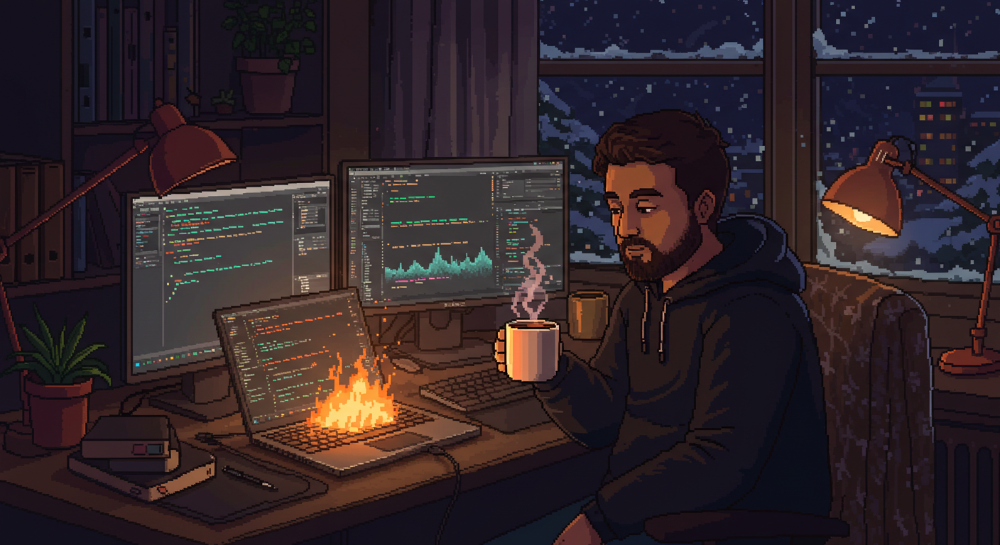

## ☕ BRB, Coffee Time!
**(Actual Footage)**

Hey there! I'm on my coffee break—I'll BRB once [this](#-coffee-break-timer) timer finishes. In the meantime, why not learn a [bit about me](#about-me)? 👇

### ☕ Coffee Break Timer
```python
def coffee_break():
    while True:
        drink_coffee()
        refill_coffee()
    return
```


## About Me

- **Hi, I'm Yassin!**  
  I'm a student at the **University of Minnesota Twin Cities**, specializing in **Data Science and AI**.

-  **My Interests**  
  I'm super passionate about **LLM frameworks**, **Retrieval-Augmented Generations (RAGs)**, **agents**, and all the cool innovations happening in AI!

- 💻 **Backend Developer**  
  I have experience building solid APIs and systems using:
  - **Spring Boot**  
  - **Python Flask**  

## Data Science

- 📊 **Exploratory Data Analysis & Data Cleaning**  
  Proficient in using Python libraries like **Pandas**, **NumPy**, and **Matplotlib** for uncovering insights and cleaning datasets.  

- 🤖 **Machine Learning Models**  
  Experience in building and tuning models for prediction, classification, and clustering tasks using libraries like **Scikit-learn** and **TensorFlow**.

- 🌍 **Spatial Data Science**  
  Interested in **spatial databases** and working with **spatial data querying, storing, and indexing** using tools like **PostGIS** and **OGIS**.

- 🔍 **Information Retrieval & Storing**  
  Skilled in using different database systems for storing and querying data:
  - **Relational Databases** (e.g., PostgreSQL, MySQL)  
  - **NoSQL Databases** (e.g., MongoDB)  
  - **Vector Databases** (e.g., Faiss)  

Feel free to explore my repos and connect with me. _**(Once my coffee timer ends)**_

